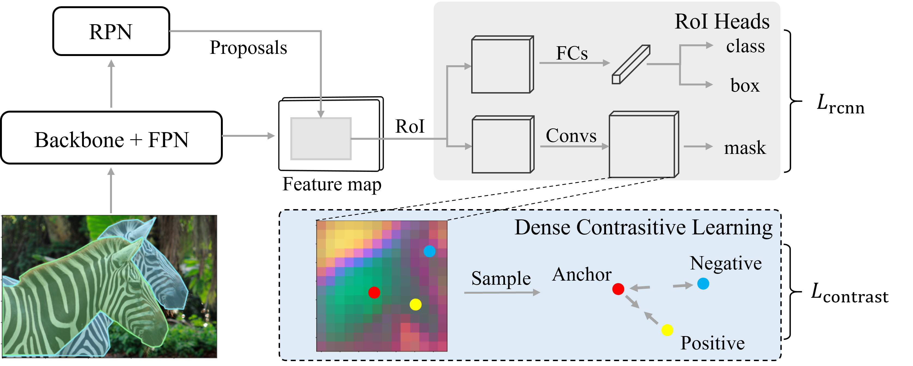

# Dense Contrastive Loss for Instance Segmentation (BMVC 2022)

This is the official repo for ["Dense Contrastive Loss for Instance Segmentation"](https://bmvc2022.mpi-inf.mpg.de/1062.pdf) accepted by BMVC 2022.


## Introduction

In this work, we analyzed the segmentation errors of some typical instance segmentation models. We found that false negatives (i.e. misclassification of foreground pixels as background) accounted for the majority of errors. It can be attributed to the inconsistent features of the same instance under complex scenarios. To address this problem, we proposed a dense contrastive loss to encourage the segmentation network to learn more consistent feature representations. Specifically, features on the same instance are pulled closer, while features on different instances and features between instances and the background are pushed farther apart. Without introducing any extra inference cost, the proposed method mitigated false-negative errors and achieved significant improvements on the Cityscapes and MS-COCO datasets.

<p align="center">

</p>


For more details, please refer to our [paper](https://bmvc2022.mpi-inf.mpg.de/1062.pdf) or [poster](https://bmvc2022.mpi-inf.mpg.de/1062_poster.pdf).


## Installation

This project is based on [detectron2](https://github.com/facebookresearch/detectron2) framework (v0.6, commit 8ba4dd8). 

Please follow the [official instructions](https://detectron2.readthedocs.io/en/latest/tutorials/install.html) to install detectron2 first. 

```
git clone https://github.com/facebookresearch/detectron2.git
git checkout 8ba4dd8
# cd detectron2 and run
python setup.py build develop
```

## Data preparation

Please follow the [document](https://detectron2.readthedocs.io/en/latest/tutorials/builtin_datasets.html). The default dataset directory in our project is `./datasets`.


## Training

* Training Mask R-CNN + DCL on Cityscapes dataset (initialized from ImageNet):

    ```bash
    python train_net.py \
        --num-gpus 4 \
        --config-file configs/cityscapes_mask_rcnn_R_50_FPN.yaml \
        SOLVER.IMS_PER_BATCH 8 \
        MODEL.ROI_HEADS.NAME ContrastRoIHeads \
        MODEL.ROI_MASK_HEAD.NAME ContrastConvUpsampleHead \
        OUTPUT_DIR work_dirs/cityscapes_mask_rcnn_dcl
    ```

* Training Mask R-CNN + DCL on COCO dataset:

    ```bash
    python train_net.py \
        --num-gpus 4 \
        --config-file configs/coco_mask_rcnn_R_50_FPN_1x.yaml \
        SOLVER.IMS_PER_BATCH 16 \
        MODEL.ROI_MASK_HEAD.CONTRAST_LOSS.LOSS_WEIGHT 0.1 \
        MODEL.ROI_HEADS.NAME ContrastRoIHeads \
        MODEL.ROI_MASK_HEAD.NAME ContrastConvUpsampleHead \
        OUTPUT_DIR work_dirs/coco_mask_rcnn_dcl
    ```

Note that we train with 4 GPUs by default.


## Evaluation

* Test on Cityscapes:

    ```bash
    python train_net.py \
        --eval-only \
        --num-gpus 2 \
        --config-file configs/cityscapes_mask_rcnn_R_50_FPN.yaml \
        MODEL.WEIGHTS work_dirs/cityscapes_mask_rcnn_dcl/model_final.pth \
        OUTPUT_DIR work_dirs/cityscapes_mask_rcnn_dcl
    ```

* Test on COCO:

    ```bash
    python train_net.py \
        --eval-only \
        --num-gpus 2 \
        --config-file configs/coco_mask_rcnn_R_50_FPN_1x.yaml \
        MODEL.WEIGHTS work_dirs/coco_mask_rcnn_dcl/model_final.pth \
        OUTPUT_DIR work_dirs/coco_mask_rcnn_dcl
    ```

* Evaluate the three segmentation errors (i.e. fFP, bFP, FN):

    ```bash
    python tools/seg_error_analyze.py \
        prediction.json \
        -a ground_truth.json
    ```


## Models

| Detector   | Pretrain  | Dataset |  AP | Config | Checkpoint |
| :------:   | :------:  | :------: | :------: | :------: | :------: |
| Mask R-CNN | ImageNet | Cityscapes | 37.1 | [cityscapes_mask_rcnn_R_50_FPN.yaml](configs/cityscapes_mask_rcnn_R_50_FPN.yaml) | [Tsinghua Cloud](https://cloud.tsinghua.edu.cn/f/25b641d7ea2f4b34ac82/?dl=1) |
| Mask R-CNN | COCO     | Cityscapes | 38.6 | [cityscapes_mask_rcnn_R_50_FPN_coco.yaml](configs/cityscapes_mask_rcnn_R_50_FPN_coco.yaml) | [Tsinghua Cloud](https://cloud.tsinghua.edu.cn/f/e819b0f1aabc42dcb482/?dl=1) |
| RefineMask | ImageNet  | Cityscapes | 39.3 | [more_models/RefineMask](more_models/RefineMask) | [Tsinghua Cloud](https://cloud.tsinghua.edu.cn/f/aed0b666c7d34454b4fa/?dl=1) |
| Mask R-CNN | ImageNet  | COCO | 35.6 | [coco_mask_rcnn_R_50_FPN_1x.yaml](configs/coco_mask_rcnn_R_50_FPN_1x.yaml) | [Tsinghua Cloud](https://cloud.tsinghua.edu.cn/f/4298adf3b07441188430/?dl=1) |


## Acknowledgments

This project is based on [detectron2](https://github.com/facebookresearch/detectron2). Thanks for their excellent work.


## Citation

```bibtex
@inproceedings{Chen_2022_BMVC,
author    = {Hang Chen and Chufeng Tang and Xiaolin Hu},
title     = {Dense Contrastive Loss for Instance Segmentation},
booktitle = {33rd British Machine Vision Conference 2022, {BMVC} 2022, London, UK, November 21-24, 2022},
publisher = {{BMVA} Press},
year      = {2022},
url       = {https://bmvc2022.mpi-inf.mpg.de/1062.pdf}
}
```